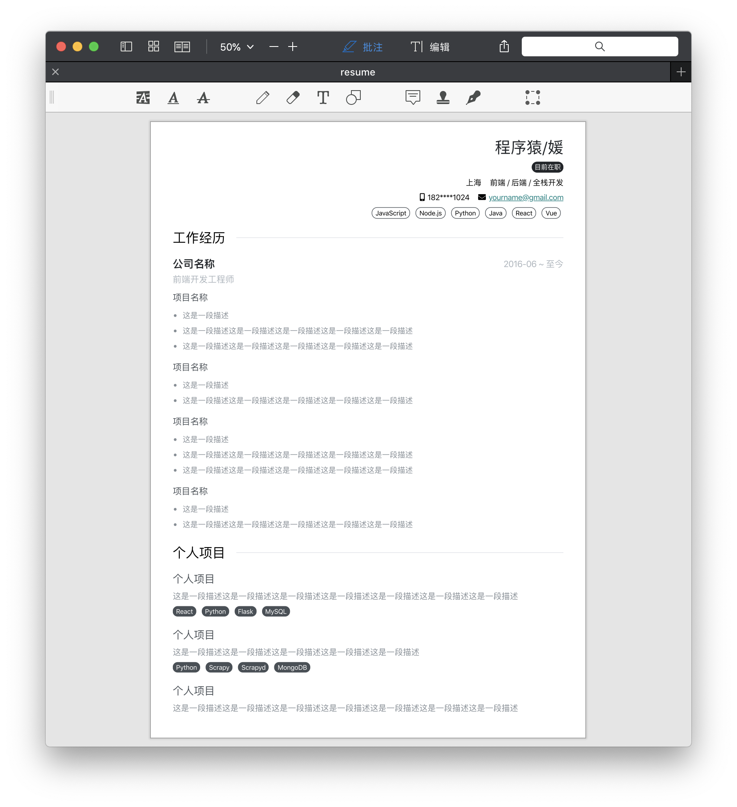

# resume-generator
A resume generator

## 关于
一开始发现这个网站[hacknical](https://hacknical.com/)可以在线写简历，预览效果不错，但是下载的PDF简历有问题，所以就想着自己写个工具。主要思路：用`pug`编写简历模版，读取`resume.json`里定义的简历数据并渲染进模版，`scss`（`CSS`预处理器）编写简历样式。项目参考了[张秋怡](https://github.com/joyeecheung)的部分实现（原仓库已删除）。

## 预览
[查看PDF](./src/pdf/resume.pdf)


## 环境准备
`Node.js >= 8.9.0`

## 安装
```
npm install --global gulp-cli
```
```
# 安装依赖
npm install
```

## 使用
简历数据存储在`resume.json`，可自行修改
```
# 本地预览
gulp dev
```
```
# 生成PDF简历
gulp pdf
```