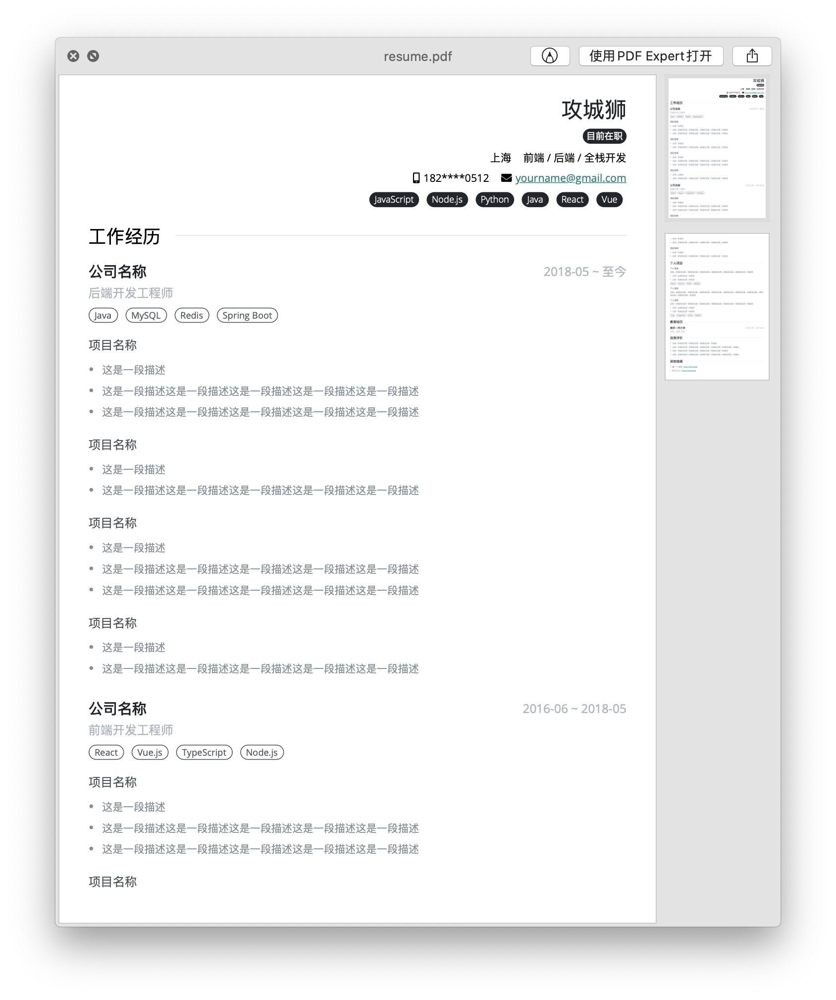
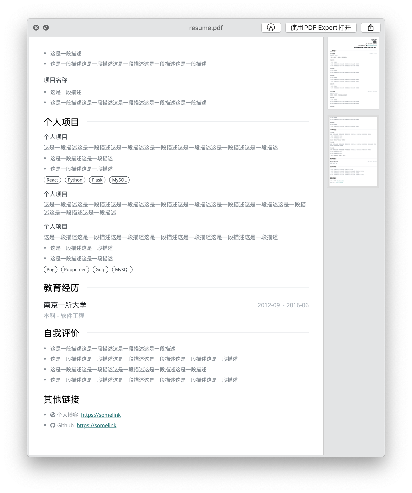

# resume-generator
A resume generator

## 预览

## Get Started
- 环境`Node.js >= 12.0`
- 运行`npm install --global gulp-cli`安装gulp命令行工具
- 运行`npm install`安装依赖
- 运行`gulp dev`本地预览
- 编辑`resume.json`，可实时预览简历
- 运行`gulp pdf`生成PDF格式简历

## 其他
简历CSS样式参考自[hacknical](https://hacknical.com/)
